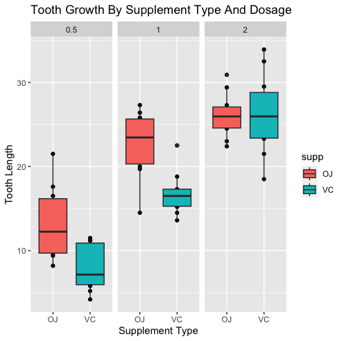

# Tooth-Growth-By-Supplement-And-Dosage

Using tooth growth data from the R dataset ToothGrowth, this experiment was done to determine how supplement type and dosage may affect tooth growth.  After conducting hypothesis testing, it was determined that dosage subgroups have longer teeth as the dosage increases, supplement subgroups have different lengths of teeth, and supplement type subgroups do not have different tooth lengths with double dosage.

